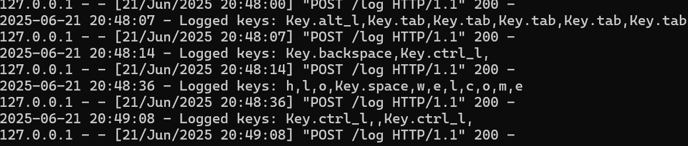
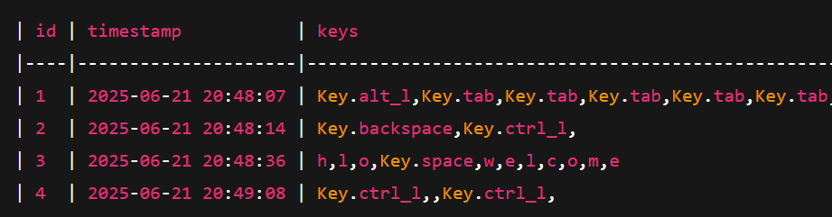

# 🔐 Educational Keylogger (Python)

A simple keylogger built using Python for **educational and ethical purposes only**. It captures keystrokes on your own system, encrypts them using Fernet (AES-based), and sends them to a local Flask server which decrypts and stores the logs in a SQLite database.

---

## 📸 Screenshots

### 🖥️ Server Logging



### ⌨️ SQLite Viewer



## ⚙️ Features

- 🔒 Encrypted data transmission using Fernet (AES)
- 🕒 Buffered logging every 10 seconds (not char-by-char)
- 🗃️ Logs stored in a local SQLite database
- 🧪 Fully offline and educational
- 🧵 Background threading for smooth performance

---

## 🛠 Requirements

Install Python dependencies with:

```bash
pip install pynput flask cryptography


📂 Project Structure
keylogger_project/
├── keylogger.py         # The keylogger script (client)
├── receiver_server.py   # Flask server that receives and stores logs
├── secret.key           # Shared Fernet key (generated)
├── generate_key.py      # Script to generate encryption key
├── keylogs.db           # Auto-created SQLite database
└── screenshots/         # Optional folder for screenshots

🚀 How to Use
1. Clone this repo or copy files
2. Generate the encryption key (only once)
python generate_key.py

3. Start the Flask server (in Terminal 1)
python receiver_server.py

4. Start the keylogger (in Terminal 2)
python keylogger.py

Your server will receive and store encrypted logs every 10 seconds.

*** secret.key and keylogs.db are created automatically when we run the above scripts. 


